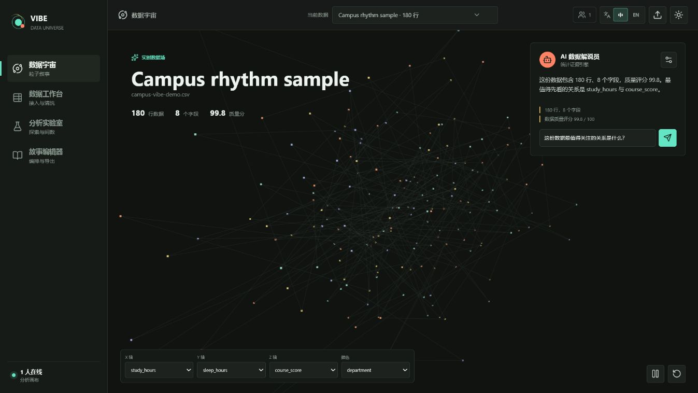
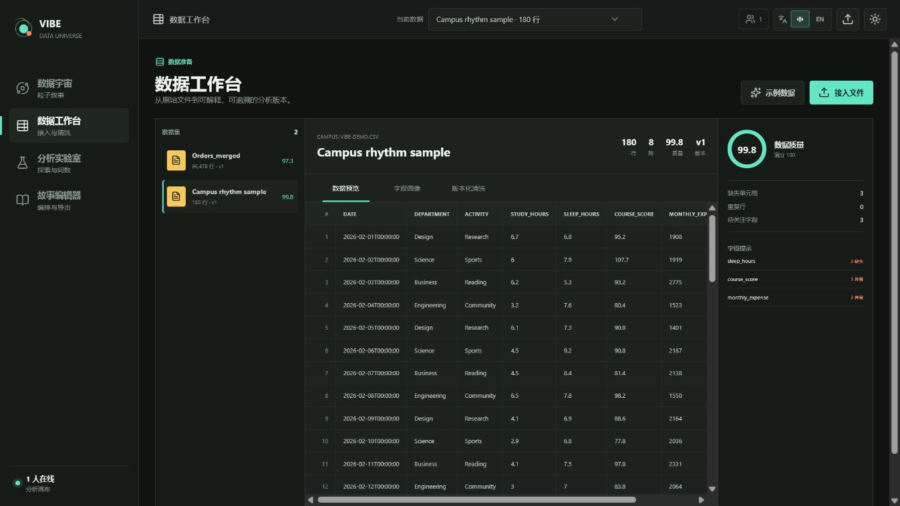
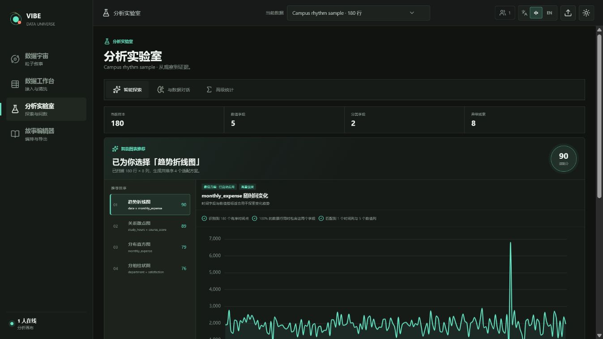
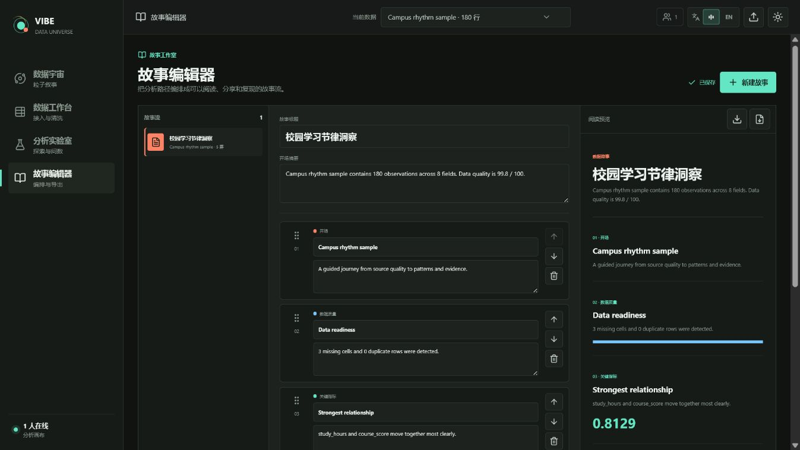
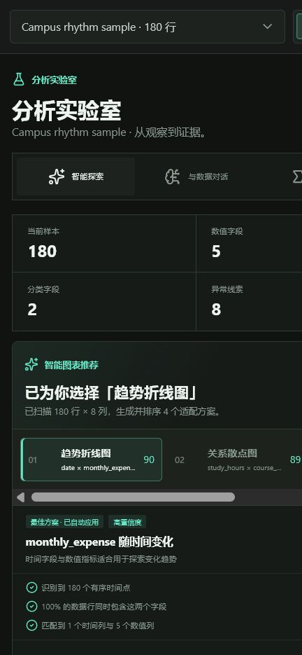

# Vibe Data Universe

面向大学生、科研人员与数据分析初学者的本地优先数据探索系统。它把文件接入、数据画像、版本化清洗、智能分析、3D 粒子叙事和报告导出组织成一条连续工作流。

[](https://github.com/here-forever/Data-Universe/actions/workflows/ci.yml)



## 核心能力

- **数据宇宙**：将每一行数据映射为 3D 粒子，支持旋转、缩放、自动巡航、轴与颜色映射、粒子检查和 AI 解说。
- **数据工作台**：拖拽接入 CSV、Excel、JSON、TXT，查看分页数据、字段画像、质量问题和修订历史。
- **分析实验室**：自动 EDA、智能图表推荐、图表联动、相关性矩阵、异常检测、自然语言问数和高级统计。
- **故事编辑器**：把指标、图表、质量信息和叙述编排成故事流，支持 HTML 与 PDF 导出。
- **本地优先**：默认使用 SQLite 和本地文件系统，不要求登录；未配置大模型时仍可完整使用统计分析能力。
- **可靠体验**：路由按用户导航意图预加载，查询失败可原地重试，运行时异常提供全局恢复页面，避免意外白屏。

## 系统效果

| 数据工作台                                         | 智能图表推荐                                     |
| -------------------------------------------------- | ------------------------------------------------ |
|  |  |

| 故事编辑器                                       | 移动端分析                                              |
| ------------------------------------------------ | ------------------------------------------------------- |
|  |  |

## 工作流程

```text
CSV / Excel / JSON / TXT
  -> 自动画像与质量评分
  -> 版本化清洗
  -> EDA / 自然语言问数 / 高级统计
  -> 3D 数据粒子叙事
  -> 故事流编辑
  -> HTML / PDF 导出
```

## 快速开始

### 环境要求

- Python 3.13
- Node.js 24
- [uv](https://docs.astral.sh/uv/)

### 本地开发

启动后端：

```powershell
cd backend
uv sync --extra dev
uv run alembic upgrade head
uv run uvicorn app.main:app --reload --host 127.0.0.1 --port 8000
```

另开一个终端启动前端：

```powershell
cd frontend
npm ci
npm run dev
```

打开 `http://127.0.0.1:5173`。首次进入且没有数据集时，系统会自动创建校园学习节律演示数据；也可以上传 [`examples/student_learning_rhythm.csv`](examples/student_learning_rhythm.csv)。

### Docker

```powershell
docker compose up --build
```

- Web 应用：`http://127.0.0.1:5173`
- API 文档：`http://127.0.0.1:8000/docs`

运行数据保存在 Docker 卷 `backend_storage` 中。

## 项目结构

```text
Data-Universe/
├─ backend/                 FastAPI、数据处理、分析、故事与导出
│  ├─ app/
│  │  ├─ api/              HTTP 与 WebSocket 路由
│  │  ├─ core/             配置、数据库与错误处理
│  │  ├─ data/             文件解析、画像、版本和清洗
│  │  ├─ insights/         EDA、问数、图表推荐和统计分析
│  │  ├─ stories/          故事编排与 HTML/PDF 导出
│  │  └─ models/           SQLAlchemy 数据模型
│  ├─ alembic/             数据库迁移
│  └─ tests/               后端自动化测试
├─ frontend/                React、TypeScript 与 Vite 应用
│  └─ src/
│     ├─ app/              应用外壳、路由和查询客户端
│     ├─ features/         数据、分析、宇宙、故事和协作界面
│     ├─ i18n/             中英文文案
│     ├─ lib/              API 客户端与类型
│     └─ styles/           全局响应式样式
├─ docs/                    使用手册、设计说明与效果图
│  ├─ screenshots/         可直接用于 GitHub 展示的系统截图
│  └─ USER_GUIDE.md        完整系统使用手册
├─ examples/                可直接导入的演示数据
├─ docker/                  前后端镜像定义
├─ scripts/                 项目辅助脚本
├─ .github/                 CI、Dependabot 与 PR 模板
└─ docker-compose.yml       一键本地部署编排
```

## 可选大模型

复制 `.env.example` 为 `.env`，只在需要外部 AI 解说时设置：

```text
LLM_API_KEY=...
LLM_BASE_URL=https://api.openai.com/v1
LLM_MODEL=gpt-5-mini
LLM_API_STYLE=responses
```

`LLM_API_STYLE` 支持 `responses` 和 `chat_completions`。也可以在“数据宇宙”或“分析实验室”的模型设置中选择 OpenAI、DeepSeek、通义千问或自定义兼容服务。界面中的 API Key 只保留在当前应用会话，不写入浏览器持久存储、数据库或分析历史。

未启用外部模型时，自然语言问数仍由本地统计证据引擎完成。无论使用哪种模式，系统都只向外部模型发送聚合画像和分析结果，不发送原始数据行。

## 验证

```powershell
cd backend
uv run ruff check app tests
uv run pytest

cd ..\frontend
npm run lint
npm test -- --run
npm run build
npm run format
```

后端测试覆盖四种文件接入、画像、版本化清洗、EDA、智能图表推荐、联动筛选、自然语言问数、高级统计、粒子数据、WebSocket、故事编辑和两类导出。

## 文档

- [系统使用手册](docs/USER_GUIDE.md)
- [重建范围与验收映射](docs/REBUILD_PLAN.md)
- [原始需求文档](docs/instruction.md)
- [后端开发说明](backend/README.md)
- [前端开发说明](frontend/README.md)
- [Docker 说明](docker/README.md)

## 数据边界

- 文件接入支持 CSV、Excel（`.xlsx` / `.xls`）、JSON 和 TXT。
- 默认单文件上限 128 MiB、50 万行、300 列，可通过环境变量调整。
- 上传文件、SQLite 数据库、导出报告、密钥和 `.env` 均被 Git 忽略。
- 系统不包含账户、权限、外部数据库连接、SQL 工作台、任务中心或传统仪表盘。
